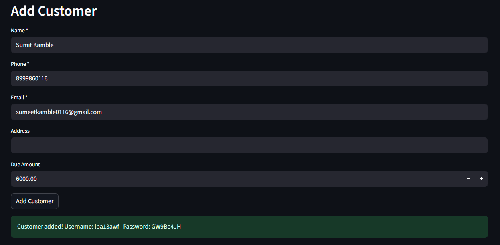
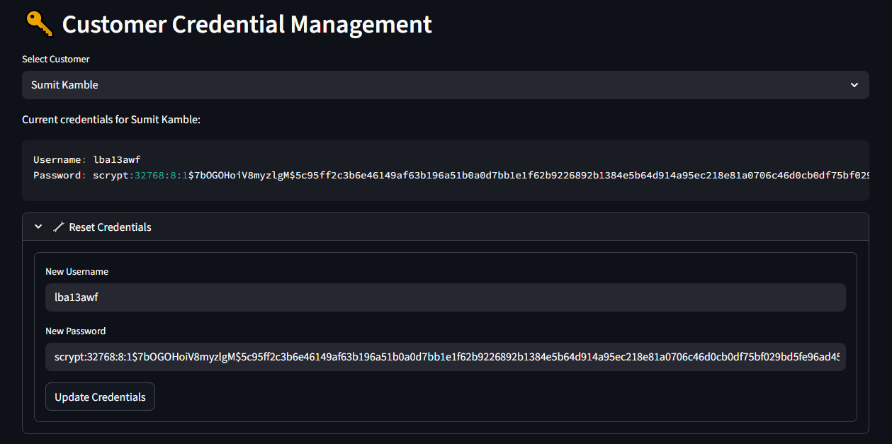
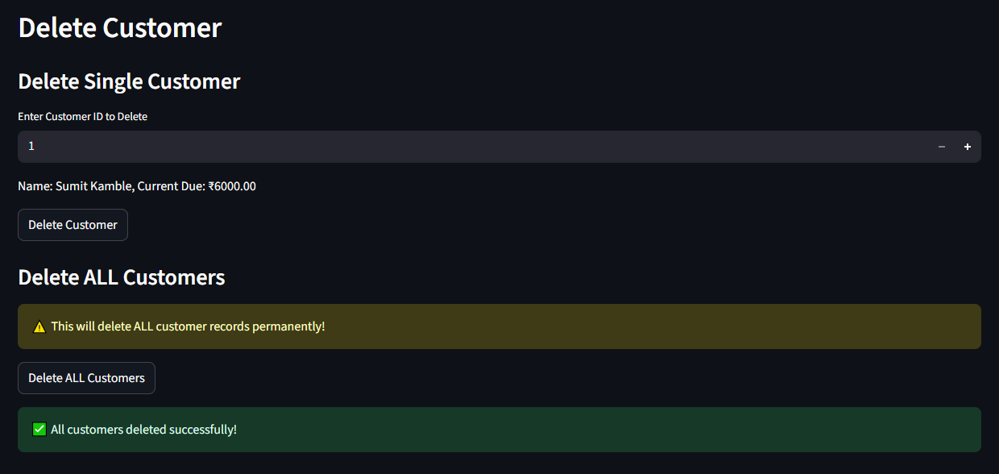
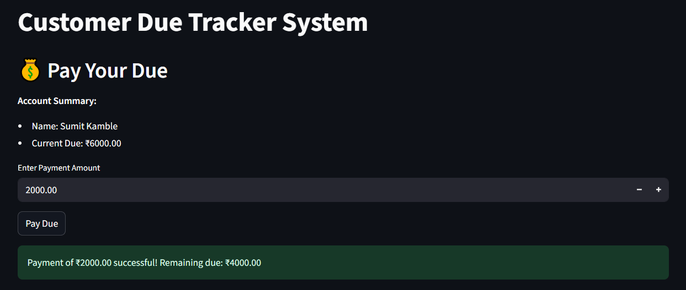
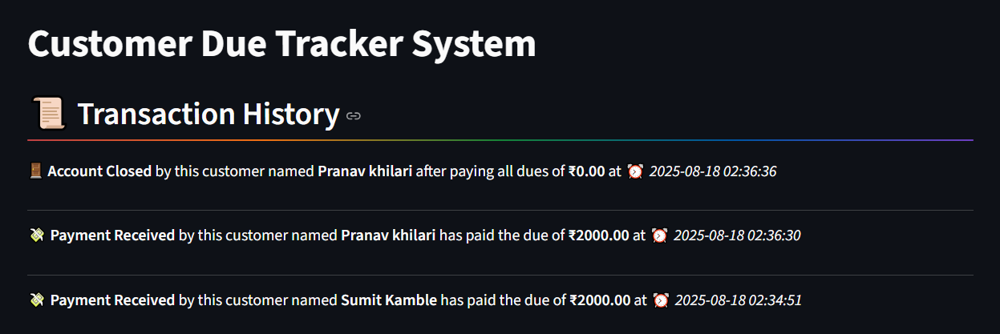
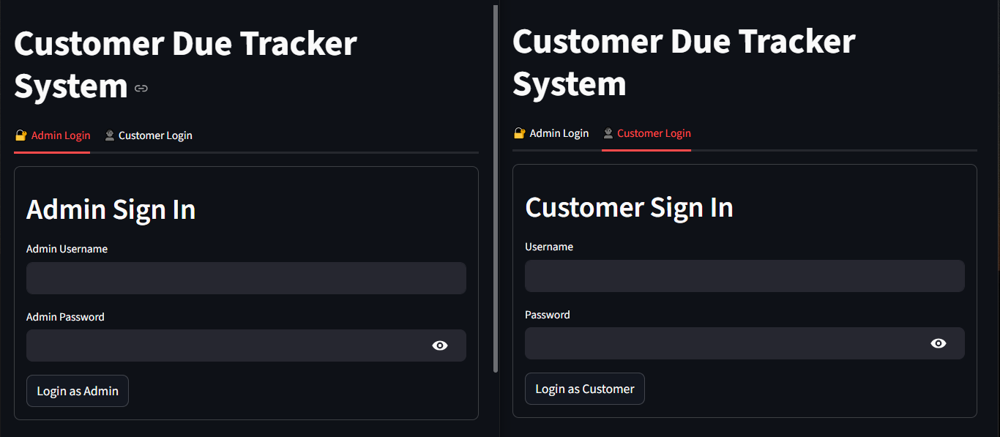
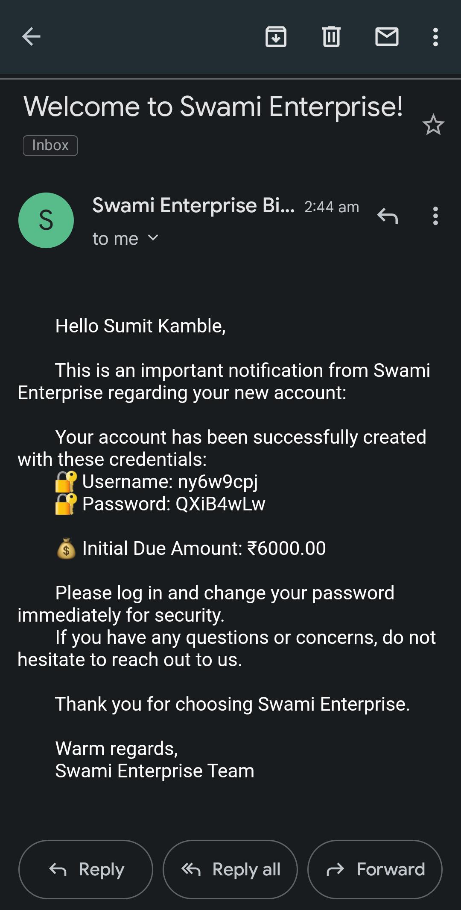
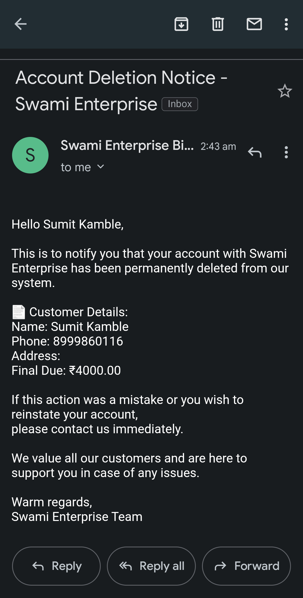

**📕 CUSTOMER DUE TRACKER SYSTEM**


## PROJECT OVERVIEW :--
The **CUSTOMER DUE TRACKER SYSTEM** is a complete solution for businesses to manage customer payments, track outstanding dues, and automate reminders. It provides a secure and user-friendly platform where administrators can manage customer accounts, monitor payments, and send automated notifications via email. Customers can log in to view their dues, make partial or full payments, and access their payment history. The system combines a Flask-based backend with a Streamlit-powered frontend dashboard, ensuring smooth interaction, real-time tracking, and insightful analytics. With built-in authentication, activity logging, and scheduling features, this system helps businesses streamline payment management and improve customer communication effectively.


## CORE FEATURES :--
  **Customer Management**
  - Add, update, and delete customer records  
  **Due Tracking**
  - Track outstanding payments and partial payments  
  **Authentication**
  - Secure login for both admin and customers  
  **Email Notifications**
  - Automated emails for payments, Automated daily messaging, due reminders, and account changes  
  **Dashboard**
  - Visual analytics of customer dues and payment status  
  **User Portal**
  - Customers can view their dues and make payments  
  **Activity Logging**
  - Detailed logs of all system activities  
  **Storage** 
    - Customer and logs stored in CSV files 


# BACKEND
  - RESTful API Built with Flask (Python) — provides RESTful APIs for customer, due, and payment management.
  - Handles authentication, business logic, background scheduling (for reminders), and logging.
  - Uses CSV files for data storage (lightweight and simple to use, but can be swapped with a database later).
  - Manages email notifications using SMTP integration for account creation, reminders, and receipts.

# FRONTEND
  - Built with Streamlit (Python) — provides an powered, interactive and intuitive dashboard.
  - Allows admins to manage customers, view analytics, and send notifications.
  - Allows customers to log in, view dues, make partial payments, and check history and manage their accounts.
  - Provides a clean, responsive interface with real-time updates from the backend APIs.


**TECHNOLOGIES USED**

  - Python 3.x – Core language
  - Flask – Backend REST API
  - Streamlit – Frontend dashboard
  - CSV Files – Data storage
  - SMTP – Email notifications
  - .env – Environment variables
  - Schedule – Task scheduling


**LIBRARIES USED**
 
  - Flask, Flask-CORS – API & cross-origin support
  - Streamlit – UI framework
  - Pandas – CSV handling & analytics
  - Requests – API communication
  - Schedule – Background jobs
  - python-dotenv – Env variable management
  - smtplib, email.mime – Email handling
  - csv, logging, functools, datetime, os – Standard Python utilities


**How the Project Works**

1.  Backend (Flask) → Manages customers, dues, payments, emails, and logs (stored in CSV).
    It also runs background schedulers to send daily reminders automatically.
    All business logic and activity tracking is centralized here.

2.  Frontend (Streamlit) → Admins manage records & analytics; customers view/pay dues.
    It connects to the backend APIs and shows real-time data in an interactive dashboard.
    Provides a clean, user-friendly interface for both roles.

3.  Emails → Auto-sent for account creation, reminders, and receipts.
    This ensures both admins and customers are always updated on activities.
    Notifications improve communication and reduce missed payments.


## FOLDER STRUCTURE :--
```
Customer_Due_Tracker_System/
├── backend/
│ ├── data/ # All data storage files
│ │ ├── added_customers.csv
│ │ ├── customers.csv
│ │ ├── deleted_customers.csv
│ │ ├── dues.csv
│ │ ├── email_logs.csv
│ │ ├── logs.csv
│ │ ├── partial_customers.csv
│ │ ├── signin_logs.csv
│ │ ├── signin.csv
│ │ ├── updated_customers.csv
│ │ ├── user_account_deleted.csv
│ │ └── user_payment_updated.csv
│ ├── notifications/ # Email notification services
│ │ ├── init.py
│ │ └── email_service.py
│ ├── init.py
│ ├── app.py # Flask backend server
│ ├── decorators.py # Logging decorators
│ ├── routes.py # API endpoints
│ ├── scheduler.py # Background tasks
│ └── services.py # Business logic
├── frontend/
│ └── streamlit_app.py # Streamlit UI
├── .env # Environment variables
├── README.md # This file
├── requirements.txt # Python dependencies
├── run.bat # Windows startup script
└── test_email.py # Email testing script
```

## INSTALLATION STEPS

# Step 1
  **Install dependencies**
    - pip install -r requirements.txt

# Step 2
  **Create a .env file in the root directory**
    - EMAIL_ADDRESS = your_email@gmail.com
    - EMAIL_PASSWORD = your_app_password
    - shop_name = "Your Business Name"

# Step 3
  **To run the backend**
    - d: && cd Projects\Customer_Due_Tracker_System\backend && python app.py
  
  **To run the frontend**
    - d: && cd Projects\Customer_Due_Tracker_System\frontend && streamlit run streamlit_app.py

# Step 4
  Also you can run the run.bat file by double clicking it whivh can be run from anywhere in the system
    **Run.bat**

    @echo off
    REM Run Customer Due Tracker (from anywhere)

    REM Set your project directory (fixed path)
    set "PROJECT_DIR=D:\Projects\Customer_Due_Tracker_System"

    REM Start backend (Flask API)
    start cmd /k "cd /d "%PROJECT_DIR%\backend" && python app.py"

    REM Start frontend (Streamlit)
    start cmd /k "cd /d "%PROJECT_DIR%\frontend" && streamlit run streamlit_app.py"

# Step 5
  **Admin login**
    Username : admin
    Password : 1234

  **Customer login**
    Customers receive credentials via email when their account is created


**Admin Features**
  - Login with default credentials
  - Add/Edit/Delete customers
  - View all customer records
  - Reset customer credentials
  - Track payment history
  - View analytics dashboard
  - Send manual notifications

**Customer Features**
  - Login with credentials received via email
  - View personal due amount
  - Make partial payments
  - Delete account (when dues are cleared)
  - View payment history

**Email Notifications**
  - The system automatically sends emails for:
  - New account creation (with credentials)
  - Payment receipts
  - Due reminders
  - Account deletion confirmation
  - Credential resets

**📸 OUTPUT OF PROJECT**

## 📸 Screenshots

### Add Customer


### Customer Credentials Management


### Delete Customer


### Pay Your Due


### Transaction History


### Signin Pages


<div align="center">

### Account Created


### Account Deleted


</div>


## 📌 Developer Info

Made with ❤️ by **ELITE CODERS**  
© 2025 All rights reserved.